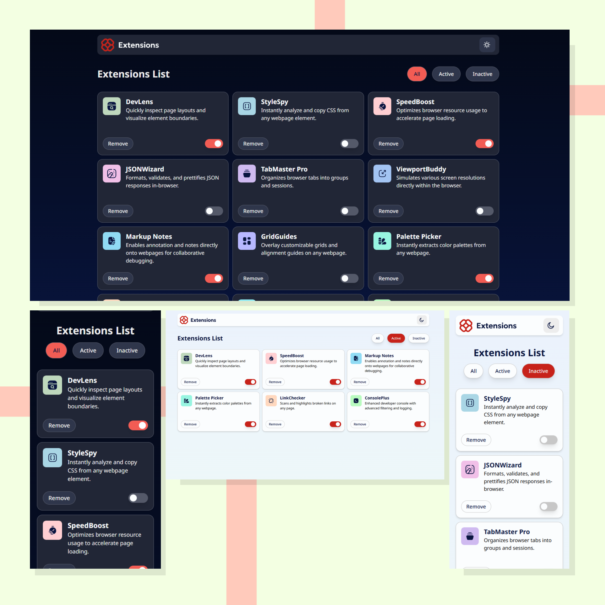

# Browser extensions manager UI



## Índice

- [Overview](#overview)
  - [o que o projeto faz](#o-que-o-projeto-faz)
- [Inicialização](#incialização)
  - [Ferramentas](#ferramentas)
- [Autor](#autor)

## Overview

Este projeto é uma solução para um desafio proposto pela plataforma Frontend Mentor, cujo objetivo é desenvolver uma interface interativa de gerenciamento de extensões de navegador. A aplicação simula um painel onde o usuário pode visualizar, ativar/desativar e remover extensões, além de filtrar entre extensões ativas, inativas ou todas. A interface foi construída com foco em responsividade, interatividade e usabilidade, utilizando conceitos modernos de desenvolvimento frontend. Cada componente foi pensado para oferecer uma experiência fluida e visualmente agradável, aproximando-se de uma aplicação real de gerenciamento de plugins ou add-ons.

### o que o projeto faz

Os usuários são capazes de:

- Alternar extensões entre os estados ativo e inativo
- Filtrar extensões ativas e inativas
- Remover extensões da lista
- Selecionar o tema de cores
- Visualizar o layout ideal para a interface, dependendo do tamanho da tela do dispositivo
- Ver os estados de foco e de foco para todos os elementos interativos na página

## Inicialização

Primeiro, execute o servidor de desenvolvimento:

```bash
npm install

npm run dev
```

Abra [http://localhost:3000](http://localhost:3000) com seu navegador para ver o resultado.

### Ferramentas

- HTML semântico
- Mobile-first workflow
- [Next.js](https://nextjs.org/)
- [Tailwind](https://tailwindcss.com/)
- [Zustand](https://zustand-demo.pmnd.rs/)

## Autor

- Website - [Portifolio](https://portifolio-self-nine.vercel.app/)
- X - [@Manrick_Lazaro](https://x.com/Manrick_Lazaro)
